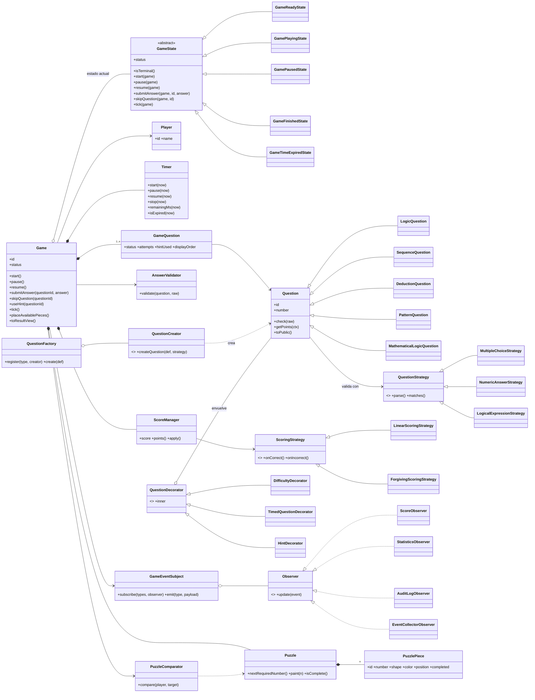
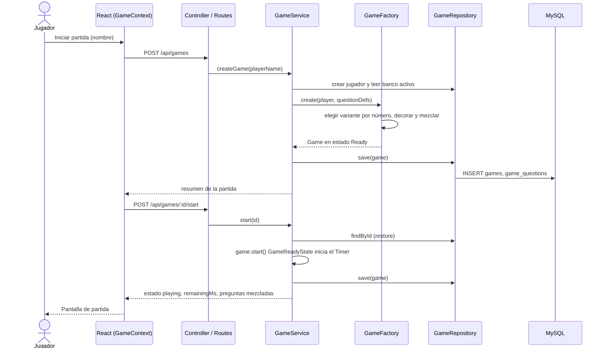
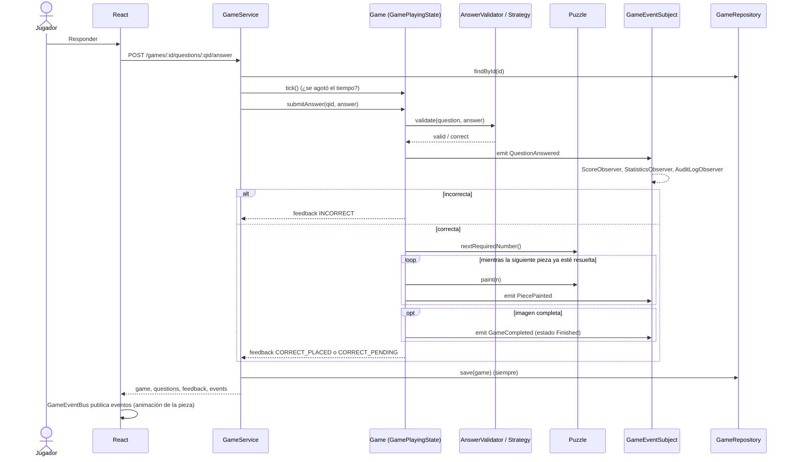
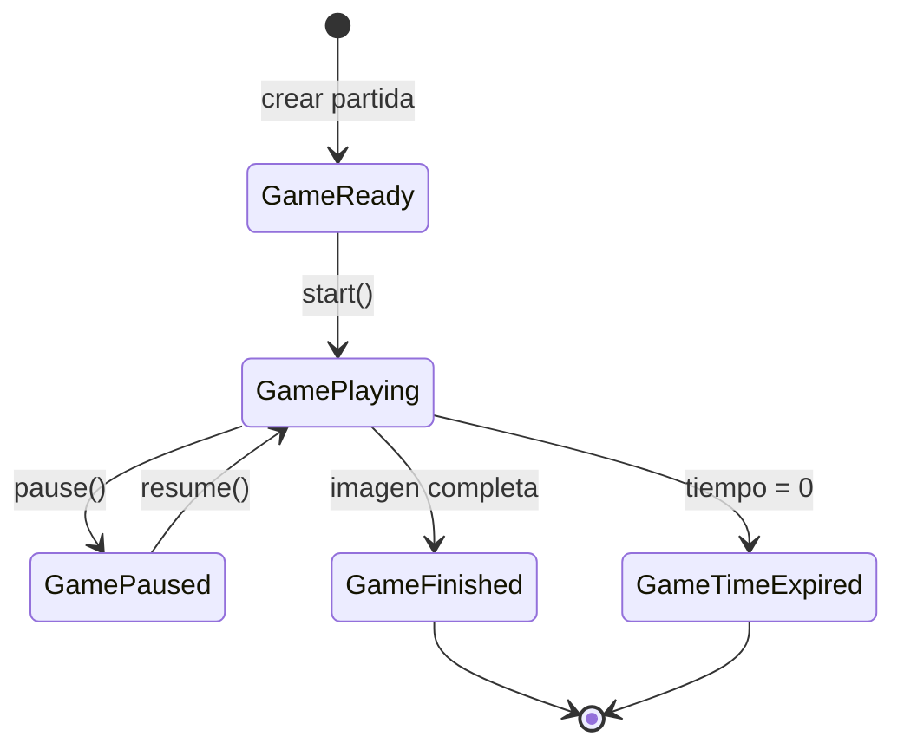
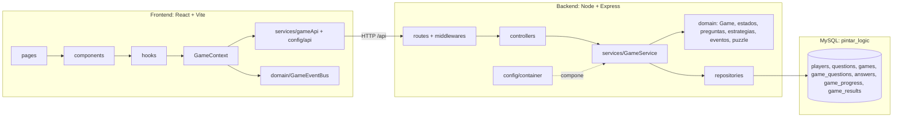

# Diagramas UML (Mermaid)

## 1. Diagrama de clases

```mermaid
classDiagram
  direction LR

  class Game {
    +id
    +status
    +start()
    +pause()
    +resume()
    +submitAnswer(questionId, answer)
    +skipQuestion(questionId)
    +useHint(questionId)
    +tick()
    +placeAvailablePieces()
    +toResultView()
  }
  class GameState {
    <<abstract>>
    +status
    +isTerminal()
    +start(game)
    +pause(game)
    +resume(game)
    +submitAnswer(game, id, answer)
    +skipQuestion(game, id)
    +tick(game)
  }
  class GameReadyState
  class GamePlayingState
  class GamePausedState
  class GameFinishedState
  class GameTimeExpiredState
  GameState <|-- GameReadyState
  GameState <|-- GamePlayingState
  GameState <|-- GamePausedState
  GameState <|-- GameFinishedState
  GameState <|-- GameTimeExpiredState
  Game o-- GameState : estado actual

  class Player { +id +name }
  class Timer {
    +start(now)
    +pause(now)
    +resume(now)
    +stop(now)
    +remainingMs(now)
    +isExpired(now)
  }
  class ScoreManager { +score +points() +apply() }
  class AnswerValidator { +validate(question, raw) }
  class GameQuestion { +status +attempts +hintUsed +displayOrder }
  Game --> Player
  Game *-- Timer
  Game *-- ScoreManager
  Game --> AnswerValidator
  Game *-- "1..n" GameQuestion
  Game *-- Puzzle

  class Question {
    +id
    +number
    +check(raw)
    +getPoints(ctx)
    +toPublic()
  }
  class LogicQuestion
  class SequenceQuestion
  class DeductionQuestion
  class PatternQuestion
  class MathematicalLogicQuestion
  Question <|-- LogicQuestion
  Question <|-- SequenceQuestion
  Question <|-- DeductionQuestion
  Question <|-- PatternQuestion
  Question <|-- MathematicalLogicQuestion
  GameQuestion --> Question

  class QuestionCreator { <<abstract>> +createQuestion(def, strategy) }
  class QuestionFactory { +register(type, creator) +create(def) }
  QuestionFactory o-- QuestionCreator
  QuestionCreator ..> Question : crea

  class QuestionDecorator { <<abstract>> +inner }
  class DifficultyDecorator
  class TimedQuestionDecorator
  class HintDecorator
  QuestionDecorator <|-- DifficultyDecorator
  QuestionDecorator <|-- TimedQuestionDecorator
  QuestionDecorator <|-- HintDecorator
  QuestionDecorator o-- Question : envuelve

  class QuestionStrategy { <<abstract>> +parse() +matches() }
  class MultipleChoiceStrategy
  class NumericAnswerStrategy
  class LogicalExpressionStrategy
  QuestionStrategy <|-- MultipleChoiceStrategy
  QuestionStrategy <|-- NumericAnswerStrategy
  QuestionStrategy <|-- LogicalExpressionStrategy
  Question --> QuestionStrategy : valida con

  class ScoringStrategy { <<abstract>> +onCorrect() +onIncorrect() }
  class LinearScoringStrategy
  class ForgivingScoringStrategy
  ScoringStrategy <|-- LinearScoringStrategy
  ScoringStrategy <|-- ForgivingScoringStrategy
  ScoreManager --> ScoringStrategy

  class GameEventSubject { +subscribe(types, observer) +emit(type, payload) }
  class Observer { <<interface>> +update(event) }
  class ScoreObserver
  class StatisticsObserver
  class AuditLogObserver
  class EventCollectorObserver
  Observer <|.. ScoreObserver
  Observer <|.. StatisticsObserver
  Observer <|.. AuditLogObserver
  Observer <|.. EventCollectorObserver
  GameEventSubject o-- Observer
  Game --> GameEventSubject

  class Puzzle { +nextRequiredNumber() +paint(n) +isComplete() }
  class PuzzlePiece { +id +number +shape +color +position +completed }
  class PuzzleComparator { +compare(player, target) }
  Puzzle *-- "n" PuzzlePiece
  PuzzleComparator ..> Puzzle
  Game --> PuzzleComparator
```

## 2. Secuencia: inicio de partida

```mermaid
sequenceDiagram
  actor J as Jugador
  participant UI as React (GameContext)
  participant API as Controller / Routes
  participant S as GameService
  participant F as GameFactory
  participant R as GameRepository
  participant DB as MySQL

  J->>UI: Iniciar partida (nombre)
  UI->>API: POST /api/games
  API->>S: createGame(playerName)
  S->>R: crear jugador y leer banco activo
  S->>F: create(player, questionDefs)
  F->>F: elegir variante por número, decorar y mezclar
  F-->>S: Game en estado Ready
  S->>R: save(game)
  R->>DB: INSERT games, game_questions
  S-->>UI: resumen de la partida
  UI->>API: POST /api/games/:id/start
  API->>S: start(id)
  S->>R: findById (restore)
  S->>S: game.start() GameReadyState inicia el Timer
  S->>R: save(game)
  S-->>UI: estado playing, remainingMs, preguntas mezcladas
  UI-->>J: Pantalla de partida
```

## 3. Secuencia: responder una pregunta

```mermaid
sequenceDiagram
  actor J as Jugador
  participant UI as React
  participant S as GameService
  participant G as Game (GamePlayingState)
  participant V as AnswerValidator / Strategy
  participant P as Puzzle
  participant E as GameEventSubject
  participant R as GameRepository

  J->>UI: Responder
  UI->>S: POST /games/:id/questions/:qid/answer
  S->>R: findById(id)
  S->>G: tick() (¿se agotó el tiempo?)
  S->>G: submitAnswer(qid, answer)
  G->>V: validate(question, answer)
  V-->>G: valid / correct
  G->>E: emit QuestionAnswered
  E-->>E: ScoreObserver, StatisticsObserver, AuditLogObserver
  alt incorrecta
    G-->>S: feedback INCORRECT
  else correcta
    G->>P: nextRequiredNumber()
    loop mientras la siguiente pieza ya esté resuelta
      G->>P: paint(n)
      G->>E: emit PiecePainted
    end
    opt imagen completa
      G->>E: emit GameCompleted (estado Finished)
    end
    G-->>S: feedback CORRECT_PLACED o CORRECT_PENDING
  end
  S->>R: save(game) (siempre)
  S-->>UI: game, questions, feedback, events
  UI->>UI: GameEventBus publica eventos (animación de la pieza)
```

## 4. Diagrama de estados

```mermaid
stateDiagram-v2
  [*] --> GameReady : crear partida
  GameReady --> GamePlaying : start()
  GamePlaying --> GamePaused : pause()
  GamePaused --> GamePlaying : resume()
  GamePlaying --> GameFinished : imagen completa
  GamePlaying --> GameTimeExpired : tiempo = 0
  GameFinished --> [*]
  GameTimeExpired --> [*]
```

## 5. Diagrama de componentes

```mermaid
flowchart LR
  subgraph Frontend [Frontend: React + Vite]
    Pages[pages] --> Components[components]
    Components --> Hooks[hooks]
    Hooks --> Context[GameContext]
    Context --> Api[services/gameApi + config/api]
    Context --> Bus[domain/GameEventBus]
  end
  subgraph Backend [Backend: Node + Express]
    Routes[routes + middlewares] --> Controller[controllers]
    Controller --> Service[services/GameService]
    Service --> Domain[domain: Game, estados, preguntas, estrategias, eventos, puzzle]
    Service --> Repos[repositories]
    Container[config/container] -.compone.-> Service
  end
  subgraph Database [MySQL: pintar_logic]
    Tables[(players, questions, games, game_questions, answers, game_progress, game_results)]
  end
  Api -- "HTTP /api" --> Routes
  Repos --> Tables
```
